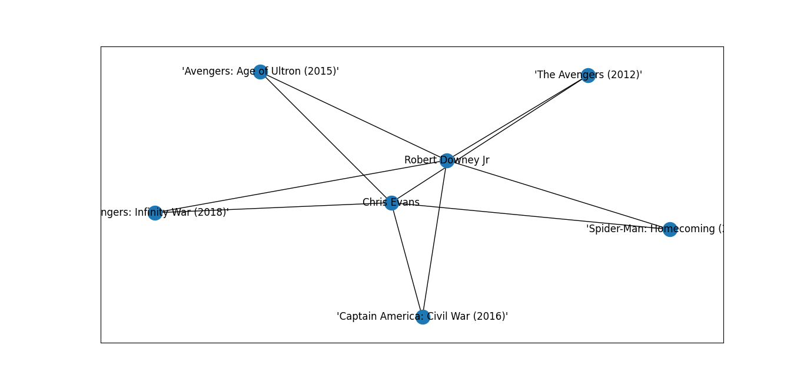

# Atores e Filmes

**Número da Lista**: 1<br>
**Conteúdo da Disciplina**: Grafos 1<br>

## Alunos
|Matrícula | Aluno |
| -- | -- |
| 19/0044799  |  Antônio Neto |
| 19/0054832  |  Artur Talles Sousa |

## Sobre 
O projeto se trata de um programa, baseado em Grafos, que relaciona Artistas e Filmes a partir um database. O programa possui as seguintes funcionalidades:
* Ao inserir um ator/atriz e um filme, o programa indica se esse artista participou do filme.
* Ao inserir dois atores/atrizes, o programa retorna os filmes em comum.
* Apresenta dois tipos de grafos: um relacionando um artista e seus filmes, o outro relacionando os filmes em comum de dois artistas.

## Screenshots
## Tela Inicial


## Relação Artista e Filme 


## Grafo do Artista e seus Filmes


## Relação Artistas e Filmes em comum


## Grafo de Filmes em comum


## Instalação 
### **Linguagem**: Phython<br>
### **Bibliotecas**: 
* **TKinter**: Biblioteca de interface gráfica Phython.
* **IMDb**: Database de cinema, atores e filmes.
* **NetworkX**: Biblioteca para implementação de Grafos em Phython.
* **Matplotlib**: Biblioteca para plotagem de gráficos.

### **Requisitos**:
* Ter instalado Phython 3 na máquina.
* Alguma IDE compatível com Phython.

## Uso 
### **1** - Clone o repositório num local de sua preferência usando o gitclone:
```
git clone https://github.com/projeto-de-algoritmos/Grafos1_Atores-e-Filmes.git
```
### **2** - Vá até o arquivo main.py

### **3** - Rode o programa. (Em caso de problemas de importação, o "quickfix" do VSCode costuma resolver)

## Outros 
Quaisquer problema, nossos contatos: (Telegram User)
* toineto04
* ArthurTalles 


